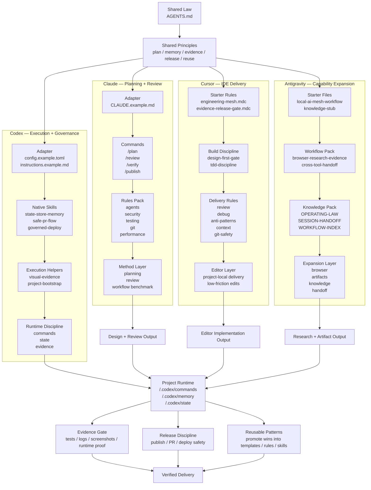

# Local AI Engineering Mesh

[](LICENSE)   

[中文](README.zh-CN.md) | [English](README.md) | [Русский](README.ru.md) | [日本語](README.ja.md) | [Français](README.fr.md)

A public-safe operating model for turning local AI tools into one governed, memory-backed, evidence-driven engineering system.

This repository is not a prompt pack and not a skill collection. It is a structured reference for building a multi-tool local AI workflow with shared rules, explicit roles, project runtime discipline, and reusable system patterns.

## TL;DR

- Start with one tool if that is all you have.
- Add shared law, project memory, and evidence discipline first.
- Grow into Codex + Cursor + Claude for the highest-performance general software workflow.
- Add Antigravity when you need broader browser, artifact, and cross-domain capability.

## Why this repository exists

Most people do not really have an AI system.
They have several tools they keep switching between.

That usually creates the same failure pattern:
- duplicated instructions
- unstable memory between tools
- inconsistent quality bars
- repeated context reset when switching
- dependence on whichever product feels best that week

This repository proposes a different model:
- one shared law
- multiple specialized endpoints
- one project runtime model
- one quality bar across tools

The point is not to make one tool do everything.
The point is to make multiple tools work together without collapsing the workflow every time you switch.

## Problems this repository solves

### 1. Your preferred tool runs out of quota, gets rate-limited, or becomes inconvenient
What usually breaks:
- you switch tools and lose the rules
- memory resets
- quality expectations drift
- you have to explain the workflow again

What this repository changes:
- tools can switch
- standards do not restart
- shared law stays the same
- project memory stays the same
- evidence and release discipline stay the same

**Hook:** `Quota exhausted? Switch tools, not standards.`

### 2. Multi-tool setups often act like isolated islands
A common pattern is:
- Claude for planning
- Cursor for coding in the editor
- Codex for command-heavy execution
- Antigravity for browser, artifact, or cross-domain work

The problem is that these tools often do not connect.

What this repository changes:
- it turns tool switching into role-based coordination
- it makes different tools share one operating law

**Hook:** `Not one perfect tool. One operating law across multiple tools.`

### 3. Switching tools usually means re-explaining everything
Typical reset cost:
- project rules
- code style
- verification expectations
- what counts as done

What this repository changes:
- shared law
- project memory
- runtime structure
- reusable templates

**Hook:** `Stop re-explaining your workflow every time you switch tools.`

### 4. Different tools usually produce different quality bars
Typical failure pattern:
- one tool optimizes for speed
- one for polish
- one for research
- one for execution

What this repository changes:
- it does not require identical strengths
- it does require one consistent quality bar

**Hook:** `Different tools, same quality bar.`

### 5. AI can produce output without producing safe output
Typical risk:
- broad edits without guardrails
- premature publish or deploy
- done claims without evidence
- weak review discipline

What this repository changes:
- evidence gates
- release discipline
- project runtime commands
- reusable review structures

**Hook:** `Not just output. Verified output.`

### 6. Many people want improvement without adopting a full mesh on day one
Typical concern:
- too heavy
- only one tool is available now
- full multi-tool setup feels premature

What this repository changes:
- start with one tool
- improve the operating layer first
- grow into a mesh later if needed

**Hook:** `Start with one tool. Grow into a mesh later.`

## At-a-glance architecture


This top-level diagram stays simple on purpose. The concrete packs under each tool are listed in **Concrete packs by tool** below and expanded further in [TOOL-LAYERS.md](docs/TOOL-LAYERS.md) and [FRAMEWORK-DIAGRAM.md](docs/FRAMEWORK-DIAGRAM.md).

## What this repository includes

- a layered system design
- a four-tool role model for Codex, Claude, Cursor, and Antigravity
- concrete public packs under each tool, not just abstract framework talk
- public-safe path conventions
- reusable templates for memory, rules, commands, workflows, and knowledge
- operating documents for governance, memory, and bootstrap
- diagrams and comparison notes for cross-platform usage

## What this system can actually do

- coordinate multiple tools under one operating law
- preserve project memory and state
- route work to the best-fit endpoint
- enforce evidence before completion
- improve single-tool usage without requiring a full mesh
- scale into a higher-performance multi-tool setup later

See [TOOL-LAYERS.md](docs/TOOL-LAYERS.md) and [WORKFLOWS-AND-COMBOS.md](docs/WORKFLOWS-AND-COMBOS.md).

## Concrete packs by tool

### Codex
Public packs already included:
- `skills/state-store-memory/`
- `skills/safe-pr-flow/`
- `skills/governed-deploy/`
- `skills/visual-evidence/`
- `skills/project-bootstrap/`
- `templates/codex/config.example.toml`
- `templates/codex/instructions.example.md`

### Claude
Public packs already included:
- `templates/claude/CLAUDE.example.md`
- `templates/claude/commands/plan.md`
- `templates/claude/commands/review.md`
- `templates/claude/commands/verify.md`
- `templates/claude/commands/publish.md`
- `templates/claude/rules-pack/`

### Cursor
Public packs already included:
- `templates/cursor/engineering-mesh.mdc`
- `templates/cursor/evidence-release-gate.mdc`
- `templates/cursor/rules-pack/`

### Antigravity
Public packs already included:
- `templates/antigravity/local-ai-mesh-workflow.md`
- `templates/antigravity/knowledge-stub.md`
- `templates/antigravity/workflows/`
- `templates/antigravity/knowledge/`

This is the layer that makes the repository useful immediately: each tool has a concrete upgrade path instead of only a role description.


## System framework

This mesh is organized in layers.

### 1. Shared law layer
The top layer defines one common engineering law for every endpoint.

Examples:
- shared operating rules
- task discipline
- quality bar
- release discipline
- evidence requirements

Anchor file:
- `AGENTS.md`

### 2. Tool adapter layer
Each AI tool keeps its own native strengths, but plugs into the same law.

Adapters in this repository are framed around:
- Codex
- Claude
- Cursor
- Antigravity

### 3. Capability layer
This layer contains reusable capabilities instead of one-off prompts.

Examples:
- skills
- rules
- workflows
- role packs
- reviewers
- deploy / QA / security helpers

### 4. Project runtime layer
This layer makes the system usable inside a real repo.

Examples:
- project commands
- project memory
- project state
- evidence collection
- execution checkpoints

### 5. Evolution layer
This layer turns repeated wins into reusable system behavior.

Examples:
- memory accumulation
- reusable patterns
- promoted workflows
- specialist review loops

## Four-tool role model and reference assessment

These scores are not universal benchmarks. They are a reference assessment of one real local setup as of **March 25, 2026**.

### Codex — 92/100
**Role in the mesh:** execution core and governance core.

**Structural layers**
- adapter layer: Codex configuration and endpoint routing
- capability layer: governed skills, reviewers, execution roles
- runtime layer: command wrappers, state, evidence, release gates
- evolution layer: skill promotion and reusable engineering patterns

**Best fit**
- disciplined local execution
- terminal-first engineering flow
- release and publish governance
- turning plans into deliverable project work

**Current tradeoff**
- product smoothness and built-in automation feel can still be less polished than Claude in some workflows

### Claude — 90/100
**Role in the mesh:** workflow methodology engine and benchmark layer.

**Structural layers**
- adapter layer: shared-law alignment and workflow compatibility
- capability layer: command culture, modular review habits, collaboration patterns
- runtime layer: strong methodology, less deep execution governance in this setup
- evolution layer: benchmark source for workflow maturity

**Best fit**
- workflow ergonomics
- modular thinking
- review culture
- polished collaboration feel

**Current tradeoff**
- in this local system, it is not the deepest execution/governance endpoint

### Cursor — 89/100
**Role in the mesh:** IDE battlefield and editor-native implementation layer.

**Structural layers**
- adapter layer: editor-facing rule alignment
- capability layer: project-local editor rules and implementation guidance
- runtime layer: fast inline coding and low-friction daily development
- evolution layer: project-level coding habits and local delivery patterns

**Best fit**
- staying close to the coding surface
- reducing day-to-day development friction
- keeping project rules near the editor

**Current tradeoff**
- weaker operating-system feel and cross-tool governance depth than Codex or Antigravity

### Antigravity — 91/100
**Role in the mesh:** broad capability platform and expansion layer.

**Structural layers**
- adapter layer: platform-facing workflow alignment
- capability layer: broad skills, browser work, knowledge, artifacts
- runtime layer: strong cross-domain execution and workflow expansion
- evolution layer: broad reusable capability growth

**Best fit**
- expanding beyond narrow coding tasks
- browser-heavy and artifact-heavy work
- acting more like a platform than a single tool

**Current tradeoff**
- breadth can introduce noise; on the core engineering path it is not always as steady as Codex

## Overall system summary — 91/100

The strength of the reference setup does not come from one unbeatable tool.
It comes from organizing multiple tools into one system with:
- shared operating law
- specialized endpoints
- project memory
- execution gates
- evidence discipline
- cross-platform consistency

The most accurate summary is:

**Shared Law + Multi-Tool Specialized AI System**

## Public-safe implementation view

To keep this repository safe to publish, local machine details are abstracted into generic layers instead of personal filesystem layout.

Public-safe labels used in this repository:
- `$SHARED_LAW_HOME/AGENTS.md`
- `$CODEX_HOME/config.toml`
- `$CODEX_HOME/instructions.md`
- `$CODEX_HOME/skills/`
- `$CODEX_HOME/memories/`
- `<project>/.codex/commands/`
- `<project>/.codex/memory/`
- `<project>/.codex/state/`
- `<project>/.cursor/rules/`
- `<antigravity-home>/skills|workflows|knowledge`

The goal is to publish the system design without leaking personal machine structure.

## Reference setup snapshot (sanitized)

This repository is based on a real working setup. In sanitized form, the reference environment includes:
- 30 Codex skills
- 3 global memory files
- 10 project governance commands
- 5 project memory files
- active project state files

That means this is not only conceptual. It already operates at:
- rules layer
- capability layer
- project runtime layer
- state layer
- evidence layer

## Public skills pack

The repository also includes a public-safe subset of original native skills under [`skills/`](skills/README.md):
- `state-store-memory`
- `safe-pr-flow`
- `governed-deploy`
- `visual-evidence`
- `project-bootstrap`

These are meant to share distinctive system behavior, not private machine state.

## Tool templates

The repository now includes public-safe starter templates for all four primary tools:
- `templates/codex/`
- `templates/claude/` (project law + commands pack + rules pack)
- `templates/cursor/` (starter rules + rules pack)
- `templates/antigravity/` (workflow stubs + workflow/knowledge pack)

This means you can start with one tool, add a second later, or grow into a full mesh without changing the overall operating model.

## Quick start

You do **not** need all four tools to use this repository.
You can start with a single tool and still improve your workflow.

### Single-tool first
```bash
git clone https://github.com/bidaiAI/local-ai-engineering-mesh.git
cd local-ai-engineering-mesh
./scripts/setup-project-runtime.sh /path/to/your-project
```

This creates:
- `<project>/.codex/memory/`
- `<project>/.codex/state/`
- `<project>/.cursor/rules/`

Then:
1. copy `templates/AGENTS.example.md` into your shared-law location
2. adapt it for your tool
3. fill in the project memory files

### Dual-tool setup
Use one execution tool and one editor/research tool under the same shared law.

### Full mesh
Connect Codex, Claude, Cursor, and Antigravity under one shared law when you are ready.

See [QUICKSTART.md](docs/QUICKSTART.md).

## Core operating documents

These are the documents that make the repository feel like a real working system rather than a collection of notes:
- [OPERATING-CHARTER.md](docs/OPERATING-CHARTER.md)
- [MEMORY-SCHEMA.md](docs/MEMORY-SCHEMA.md)
- [BOOTSTRAP-SPEC.md](docs/BOOTSTRAP-SPEC.md)
- [ARCHITECTURE.md](docs/ARCHITECTURE.md)

## Cross-platform design

In this repository’s model:
- one shared law sits at the top
- Codex acts as the strongest execution endpoint
- Claude remains a strong workflow benchmark and compatible peer
- Cursor acts as the IDE-native delivery layer
- Antigravity acts as the capability-expansion platform

So the workflow does not have to restart from zero every time you switch tools.

See [CROSS-PLATFORM.md](docs/CROSS-PLATFORM.md).

## Compared with the latest Claude

As of **March 23, 2026**, Anthropic's latest public Claude coding stack is led by:
- `Claude Opus 4.6` published on **February 5, 2026**
- `Claude Sonnet 4.6` published on **February 17, 2026**

This repository does **not** claim that a local tool automatically beats Claude on raw model capability.

Its claim is narrower and more practical:

Once local tools are upgraded with memory, governance, evidence, and release discipline, they become much more competitive on long-horizon engineering execution.

See [COMPARE-WITH-CLAUDE.md](docs/COMPARE-WITH-CLAUDE.md).

## Repository map

```text
local-ai-engineering-mesh/
├── README.md
├── README.zh-CN.md
├── README.ru.md
├── README.ja.md
├── README.fr.md
├── LICENSE
├── scripts/
│   └── setup-project-runtime.sh
├── skills/
│   ├── README.md
│   ├── state-store-memory/
│   ├── safe-pr-flow/
│   ├── governed-deploy/
│   ├── visual-evidence/
│   └── project-bootstrap/
├── docs/
│   ├── ARCHITECTURE.md
│   ├── QUICKSTART.md
│   ├── TOOL-LAYERS.md
│   ├── WORKFLOWS-AND-COMBOS.md
│   ├── BOOTSTRAP-SPEC.md
│   ├── MEMORY-SCHEMA.md
│   ├── OPERATING-CHARTER.md
│   ├── COMPARE-WITH-CLAUDE.md
│   ├── CROSS-PLATFORM.md
│   ├── EXECUTION-LOOP.md
│   ├── REPO-MAP.md
│   ├── STACK.md
│   └── FRAMEWORK-DIAGRAM.md
└── templates/
    ├── antigravity/
    │   ├── workflows/
    │   └── knowledge/
    ├── claude/
    │   ├── commands/
    │   └── rules-pack/
    ├── codex/
    ├── cursor/
    │   └── rules-pack/
    ├── global-memory/
    ├── project-memory/
    └── policy.env.example
```

See [REPO-MAP.md](docs/REPO-MAP.md).

## Included templates

This repository includes reusable templates for:
- global memory
- project memory
- Cursor rule patterns
- Antigravity workflow and knowledge stubs
- policy defaults

Adoption paths:
- single-tool first
- dual-tool setup
- full mesh: Codex + Claude + Cursor + Antigravity under one shared law

## License

Released under the [MIT License](LICENSE).
