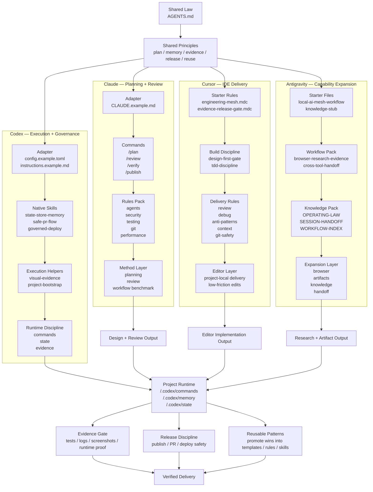

# Local AI Engineering Mesh

[](LICENSE)   

[中文](README.zh-CN.md) | [English](README.md) | [Русский](README.ru.md) | [日本語](README.ja.md) | [Français](README.fr.md)

把本地 AI 工具从彼此割裂的助手，升级成一套有治理、有记忆、有证据闭环的工程系统。

这不是 prompt 包，也不是 skill 收藏夹。它是一套可公开复用的 operating model，用来把多个 AI 工具组织成一个可协同的本地工程 mesh。

## TL;DR

- 只有一个工具，也可以先开始。
- 先补 shared law、project memory、evidence discipline。
- 对大多数软件工程场景，`Codex + Cursor + Claude` 是最高性能通用组合。
- 当你需要更强的 browser / artifact / 跨域能力时，再接入 Antigravity。

## 这个仓库为什么存在

大多数人并没有真正的 AI 系统，只是在多个工具之间不断切换。

这通常会带来同样的问题：
- 指令重复维护
- 工具之间记忆断裂
- 质量门槛不一致
- 一切依赖当前“最好用”的那个产品
- 一换工具 workflow 就要重来

这个仓库提供的是另一种思路：
- 一套共享法则
- 多个专项端点
- 一套项目运行模型
- 一条跨工具一致的质量门槛

重点不是“让一个工具包办所有事”，而是“让多个工具协同工作时，workflow 不会塌掉”。

## 这个仓库解决什么痛点

### 1. 常用工具额度不够、限流、或者暂时不方便用了
最常见的问题是：
- 一换工具，规则没了
- 记忆断了
- 质量门槛漂了
- 整套 workflow 还要重新解释

这个仓库的变化是：
- 工具可以切
- 标准不要重来
- shared law 不变
- project memory 不变
- evidence 和 release discipline 不变

**钩子句：** `Quota exhausted? Switch tools, not standards.`

### 2. 多工具并用，但每个工具像孤岛
很多人的现实分工是：
- Claude 想方案
- Cursor 在编辑器里写代码
- Codex 跑命令、做执行治理
- Antigravity 处理 browser / artifact / 跨域任务

问题是这些工具往往彼此不连。

这个仓库的变化是：
- 把来回切换变成分工协同
- 让不同工具共享同一套 operating law

**钩子句：** `Not one perfect tool. One operating law across multiple tools.`

### 3. 每次切工具都要重新讲一遍
真实重置成本包括：
- 项目规范
- 代码风格
- 验证方式
- 什么算 done

这个仓库的变化是：
- shared law
- project memory
- runtime structure
- reusable templates

**钩子句：** `Stop re-explaining your workflow every time you switch tools.`

### 4. 不同工具输出风格和质量门槛不一致
常见情况是：
- 一个偏快
- 一个偏审美
- 一个偏研究
- 一个偏执行

这个仓库的变化是：
- 不要求每个工具一样强
- 但要求它们服从同一个质量门槛

**钩子句：** `Different tools, same quality bar.`

### 5. AI 会做事，但不一定会安全地做事
常见风险：
- 一上来改一大片
- 过早发布或部署
- 没证据就说 done
- review 纪律太弱

这个仓库的变化是：
- evidence gate
- release discipline
- project runtime commands
- reusable review structure

**钩子句：** `Not just output. Verified output.`

### 6. 很多人想先提升自己，但不想第一天就上全量 mesh
常见顾虑：
- 太重
- 现在只有一个工具
- 一开始不想全套折腾

这个仓库的变化是：
- 先从单工具开始
- 先把 operating layer 补起来
- 以后再扩成 mesh

**钩子句：** `Start with one tool. Grow into a mesh later.`

## 一眼看懂的总架构


这张总图故意保持简洁。每个工具下面更具体的公开包，已经在下方 **每个工具已经公开了哪些具体包** 中列出，并在 [TOOL-LAYERS.md](docs/TOOL-LAYERS.md) 和 [FRAMEWORK-DIAGRAM.md](docs/FRAMEWORK-DIAGRAM.md) 里继续展开。

## 这个仓库包含什么

- 一套分层系统设计
- 一个针对 Codex / Claude / Cursor / Antigravity 的四工具角色模型
- 每个工具下面都有具体公开包，而不只是抽象框架说明
- 一套公开安全的路径约定
- 可复用的 memory / rules / commands / workflow / knowledge 模板
- 治理、记忆、bootstrap 等核心制度文档
- 跨平台协同与 Claude 对照说明

## 这套系统真正能做什么

- 用一套 operating law 协调多个工具
- 保留项目记忆和状态
- 把任务路由到最合适的端点
- 在完成前强制要求 evidence
- 即使只有一个工具，也能先改善 workflow
- 之后再逐步扩展成更高性能的多工具组合

参见 [TOOL-LAYERS.md](docs/TOOL-LAYERS.md) 和 [WORKFLOWS-AND-COMBOS.md](docs/WORKFLOWS-AND-COMBOS.md)。

## 每个工具已经公开了哪些具体包

### Codex
已经公开：
- `skills/state-store-memory/`
- `skills/safe-pr-flow/`
- `skills/governed-deploy/`
- `skills/visual-evidence/`
- `skills/project-bootstrap/`
- `templates/codex/config.example.toml`
- `templates/codex/instructions.example.md`

### Claude
已经公开：
- `templates/claude/CLAUDE.example.md`
- `templates/claude/commands/plan.md`
- `templates/claude/commands/review.md`
- `templates/claude/commands/verify.md`
- `templates/claude/commands/publish.md`
- `templates/claude/rules-pack/`

### Cursor
已经公开：
- `templates/cursor/engineering-mesh.mdc`
- `templates/cursor/evidence-release-gate.mdc`
- `templates/cursor/rules-pack/`

### Antigravity
已经公开：
- `templates/antigravity/local-ai-mesh-workflow.md`
- `templates/antigravity/knowledge-stub.md`
- `templates/antigravity/workflows/`
- `templates/antigravity/knowledge/`

这一层很关键，因为它说明这个仓库不是只讲角色定位，而是每个工具都已经有可以直接拿去改造的具体内容。


## 总体框架层

### 1. 共享法则层
顶层先定义整个系统共用的一套工程法则。

包括：
- 统一规则
- 任务纪律
- 质量门槛
- 发布纪律
- 证据要求

锚点文件：
- `AGENTS.md`

### 2. 工具适配层
每个 AI 工具保留自己的原生强项，但都接到同一套法则上。

这里的四个主要适配端点是：
- Codex
- Claude
- Cursor
- Antigravity

### 3. 能力层
这一层不是一次性 prompt，而是可复用能力。

包括：
- skills
- rules
- workflows
- 角色包
- reviewer
- deploy / QA / security 辅助能力

### 4. 项目运行层
这一层让系统真正落到具体仓库里。

包括：
- 项目命令
- 项目记忆
- 项目状态
- 证据采集
- 执行检查点

### 5. 进化层
这一层负责把重复成功的方法沉淀成系统能力。

包括：
- 记忆积累
- 模式沉淀
- 工作流晋升
- 专项 review 循环

## 四个 AI 工具的角色模型与参考评估

这些评分不是通用跑分，而是基于 **2026 年 3 月 25 日** 的一套真实本地环境，对其架构位置和成熟度做出的参考评估。

### Codex — 92/100
**在系统中的角色：** 执行核心 + 治理核心。

**结构层**
- 适配层：Codex 配置与端点路由
- 能力层：governed skills、reviewers、执行角色
- 运行层：commands、state、evidence、release gates
- 进化层：skill 晋升与可复用工程模式

**最适合做什么**
- 本地纪律化执行
- terminal-first 工程流
- 发布与提交治理
- 把计划推进成可交付项目结果

**当前权衡点**
- 某些默认产品体验和自动化顺滑度，仍不如 Claude 自然

### Claude — 90/100
**在系统中的角色：** 工作流方法论引擎 + 标杆层。

**结构层**
- 适配层：共享法则对齐与 workflow 兼容
- 能力层：命令文化、模块化审查习惯、协作模式
- 运行层：方法论很强，但在这套环境里执行治理接入不如 Codex 深
- 进化层：作为 workflow 成熟度的标杆来源

**最适合做什么**
- workflow 手感
- 模块化思维
- 审查文化
- 协作体验

**当前权衡点**
- 在这套本地系统里，不是最深的执行 / 治理端点

### Cursor — 89/100
**在系统中的角色：** IDE 主战场 + 编辑器原生实现层。

**结构层**
- 适配层：编辑器规则对齐
- 能力层：项目级规则与实现指导
- 运行层：快速内联编码与低摩擦开发
- 进化层：项目级编码习惯与交付模式沉淀

**最适合做什么**
- 离真实编码表面最近
- 日常开发摩擦最低
- 规则离编辑器最近

**当前权衡点**
- 系统层治理和跨工具治理深度不如 Codex / Antigravity

### Antigravity — 91/100
**在系统中的角色：** 广谱能力平台 + 扩展层。

**结构层**
- 适配层：平台型 workflow 对齐
- 能力层：宽技能覆盖、browser、knowledge、artifacts
- 运行层：跨域执行和能力扩展很强
- 进化层：广谱能力复用与平台式增长

**最适合做什么**
- 超出纯 coding 的能力扩展
- browser-heavy / artifact-heavy 工作
- 更像平台而不是单工具

**当前权衡点**
- 太宽容易有噪音；在核心工程主线上不一定比 Codex 更稳

## 整体系统总结 — 91/100

这套参考环境的优势，不在于某一个 AI 天下第一，而在于多个工具已经被组织成了一套系统。

这套系统目前已经具备：
- 共享 operating law
- 多工具专项端点
- 项目记忆
- 执行门禁
- 证据纪律
- 跨平台一致性

最准确的定义是：

**Shared Law + Multi-Tool Specialized AI System**

## 去隐私后的公开结构

为了保证仓库可以公开发布，这里把本机实现抽象成通用结构标签，而不是直接暴露个人文件系统。

仓库里使用的公开表达是：
- `$SHARED_LAW_HOME/AGENTS.md`
- `$CODEX_HOME/config.toml`
- `$CODEX_HOME/instructions.md`
- `$CODEX_HOME/skills/`
- `$CODEX_HOME/memories/`
- `<project>/.codex/commands/`
- `<project>/.codex/memory/`
- `<project>/.codex/state/`
- `<project>/.cursor/rules/`
- `<antigravity-home>/skills|workflows|knowledge`

目标是公开系统设计，而不是暴露个人机器结构。

## 参考环境快照（已脱敏）

这个仓库背后对应的是一套真实可运行环境。在脱敏后，可以概括为：
- 30 个 Codex skills
- 3 个全局记忆文件
- 10 个项目治理命令
- 5 个项目记忆文件
- 活跃的项目状态文件

这说明它不是概念，而是已经跑在：
- 规则层
- 能力层
- 项目运行层
- 状态层
- 证据层

## 公开技能包

仓库还包含一组公开安全的原生技能子集，位于 [`skills/`](skills/README.md)：
- `state-store-memory`
- `safe-pr-flow`
- `governed-deploy`
- `visual-evidence`
- `project-bootstrap`

这些技能分享的是系统行为能力，而不是私有机器状态。

## 工具模板

仓库现在已经包含四个主要工具的公开安全模板层：
- `templates/codex/`
- `templates/claude/`（项目 law + commands pack + rules pack）
- `templates/cursor/`（starter rules + rules pack）
- `templates/antigravity/`（workflow stub + workflow/knowledge pack）

这意味着你可以先从一个工具开始，之后再逐步接第二个、第三个，而不需要改掉整体 operating model。

## 快速开始

你**不需要一开始就有四个工具**。
先从单工具开始，也能明显提升 workflow。

### 单工具先上
```bash
git clone https://github.com/bidaiAI/local-ai-engineering-mesh.git
cd local-ai-engineering-mesh
./scripts/setup-project-runtime.sh /path/to/your-project
```

这会创建：
- `<project>/.codex/memory/`
- `<project>/.codex/state/`
- `<project>/.cursor/rules/`

然后：
1. 把 `templates/AGENTS.example.md` 复制到你的 shared-law 位置
2. 按你的工具调整
3. 把项目记忆文件补完整

### 双工具协作
让一个执行工具和一个编辑器/研究工具共用同一套法则。

### 全量 Mesh
等你准备好了，再把 Codex、Claude、Cursor、Antigravity 接到同一套 shared law 下。

参见 [QUICKSTART.md](docs/QUICKSTART.md)。

## 核心制度文档

下面这些文档让这个仓库更像一套真实可运行的系统，而不是零散笔记：
- [OPERATING-CHARTER.md](docs/OPERATING-CHARTER.md)
- [MEMORY-SCHEMA.md](docs/MEMORY-SCHEMA.md)
- [BOOTSTRAP-SPEC.md](docs/BOOTSTRAP-SPEC.md)
- [ARCHITECTURE.md](docs/ARCHITECTURE.md)

## 跨平台协同设计

在这个仓库的模型里：
- 一套共享法则在最上层
- Codex 负责最强执行
- Claude 仍然是重要 workflow 标杆和兼容端点
- Cursor 负责 IDE 原生交付层
- Antigravity 负责能力扩展平台层

所以重点不是“切换到哪个工具”，而是“切换工具时 workflow 不要断”。

参见 [CROSS-PLATFORM.md](docs/CROSS-PLATFORM.md)。

## 与最新 Claude 的关系

截至 **2026 年 3 月 23 日**，Anthropic 公开的最新 Claude coding 栈主要是：
- `Claude Opus 4.6`：发布于 **2026 年 2 月 5 日**
- `Claude Sonnet 4.6`：发布于 **2026 年 2 月 17 日**

这个仓库并不声称“本地工具天然就超过 Claude 的模型能力”。

它更强调一个实际判断：

当本地工具具备记忆、治理、证据闭环和发布纪律之后，它们在长流程工程执行上的竞争力会显著上升。

参见 [COMPARE-WITH-CLAUDE.md](docs/COMPARE-WITH-CLAUDE.md)。

## 仓库结构

```text
local-ai-engineering-mesh/
├── README.md
├── README.zh-CN.md
├── README.ru.md
├── README.ja.md
├── README.fr.md
├── LICENSE
├── scripts/
│   └── setup-project-runtime.sh
├── skills/
│   ├── README.md
│   ├── state-store-memory/
│   ├── safe-pr-flow/
│   ├── governed-deploy/
│   ├── visual-evidence/
│   └── project-bootstrap/
├── docs/
│   ├── ARCHITECTURE.md
│   ├── QUICKSTART.md
│   ├── TOOL-LAYERS.md
│   ├── WORKFLOWS-AND-COMBOS.md
│   ├── BOOTSTRAP-SPEC.md
│   ├── MEMORY-SCHEMA.md
│   ├── OPERATING-CHARTER.md
│   ├── COMPARE-WITH-CLAUDE.md
│   ├── CROSS-PLATFORM.md
│   ├── EXECUTION-LOOP.md
│   ├── REPO-MAP.md
│   ├── STACK.md
│   └── FRAMEWORK-DIAGRAM.md
└── templates/
    ├── antigravity/
    │   ├── workflows/
    │   └── knowledge/
    ├── claude/
    │   ├── commands/
    │   └── rules-pack/
    ├── codex/
    ├── cursor/
    │   └── rules-pack/
    ├── global-memory/
    ├── project-memory/
    └── policy.env.example
```

参见 [REPO-MAP.md](docs/REPO-MAP.md)。

## 开源协议

采用 [MIT License](LICENSE)。
