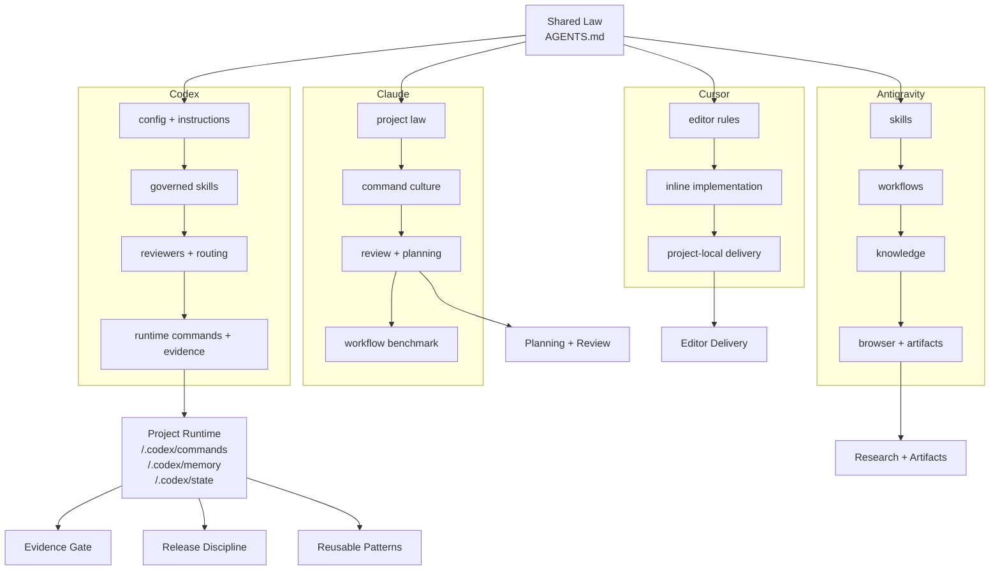

# Framework Diagram

Use this file as the source for a repository diagram or overview image.

## Diagram title

`Local AI Engineering Mesh`

## Image goal

Show that this repository is not a prompt pack.
It is a networked local AI engineering system with a shared law at the top, specialized tool layers in the middle, and project runtime discipline at the bottom.

## Mermaid version



## Simple file-tree version

```text
local-ai-engineering-mesh/
├── README.md
├── docs/
│   ├── ARCHITECTURE.md
│   ├── BOOTSTRAP-SPEC.md
│   ├── MEMORY-SCHEMA.md
│   ├── OPERATING-CHARTER.md
│   ├── TOOL-LAYERS.md
│   ├── WORKFLOWS-AND-COMBOS.md
│   ├── QUICKSTART.md
│   ├── COMPARE-WITH-CLAUDE.md
│   ├── CROSS-PLATFORM.md
│   ├── EXECUTION-LOOP.md
│   ├── REPO-MAP.md
│   ├── STACK.md
│   └── FRAMEWORK-DIAGRAM.md
├── scripts/
│   └── setup-project-runtime.sh
└── templates/
    ├── AGENTS.example.md
    ├── antigravity/
    ├── claude/
    ├── codex/
    ├── cursor/
    ├── global-memory/
    ├── project-memory/
    └── policy.env.example
```

## Suggested caption

- top layer: shared operating law
- middle layer: tool-specific structure layers
- bottom layer: project runtime, evidence, and release discipline

That is what turns separate AI tools into a governed engineering mesh.
