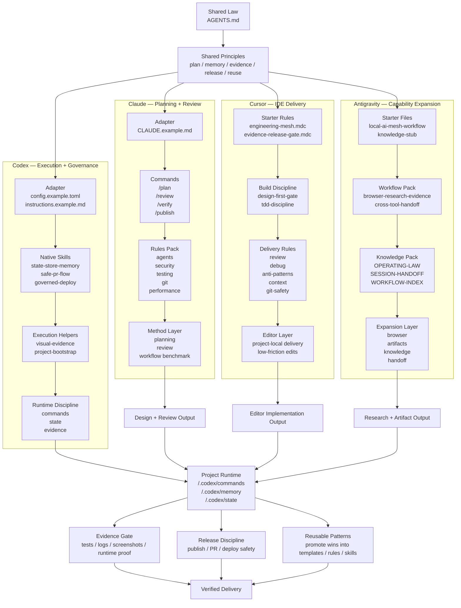

# Framework Diagram

Use this file as the source for a repository diagram or overview image.

## Diagram title

`Local AI Engineering Mesh`

## Image goal

Show that this repository is not a prompt pack.
It is a networked local AI engineering system with a shared law at the top, specialized tool layers in the middle, concrete public packs under each tool, one converged project runtime, and evidence/release discipline at the bottom.

## Mermaid version



## Simple file-tree version

```text
local-ai-engineering-mesh/
├── README.md
├── pyproject.toml
├── mesh/
│   └── commands/
├── demo/
│   └── mesh-demo.sh
├── docs/
│   ├── ARCHITECTURE.md
│   ├── BOOTSTRAP-SPEC.md
│   ├── DEMO.md
│   ├── MEMORY-SCHEMA.md
│   ├── OPERATING-CHARTER.md
│   ├── TOOL-LAYERS.md
│   ├── WORKFLOWS-AND-COMBOS.md
│   ├── QUICKSTART.md
│   ├── COMPARE-WITH-CLAUDE.md
│   ├── CROSS-PLATFORM.md
│   ├── EXECUTION-LOOP.md
│   ├── REPO-MAP.md
│   ├── STACK.md
│   └── FRAMEWORK-DIAGRAM.md
├── skills/
│   ├── README.md
│   ├── state-store-memory/
│   ├── safe-pr-flow/
│   ├── governed-deploy/
│   ├── visual-evidence/
│   └── project-bootstrap/
├── scripts/
│   └── setup-project-runtime.sh
└── templates/
    ├── AGENTS.example.md
    ├── antigravity/
    │   ├── workflows/
    │   └── knowledge/
    ├── claude/
    │   ├── commands/
    │   └── rules-pack/
    ├── codex/
    ├── cursor/
    │   └── rules-pack/
    ├── global-memory/
    ├── project-memory/
    └── policy.env.example
```

## Suggested caption

- top layer: shared operating law
- tool layer: four specialized endpoints
- concrete layer: public packs that upgrade each tool beyond stock defaults
- integration layer: plan, editor, and research outputs converge into one project runtime
- bottom layer: evidence, release discipline, and reusable patterns

That is what turns separate AI tools into a governed engineering mesh.
