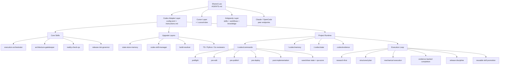

# Framework Diagram

Use this file as the source for the launch image. The easiest workflow is:

1. render the Mermaid chart
2. take a clean screenshot
3. use that screenshot as the X thread image

## Diagram title

`Local AI Engineering Mesh`

## Image goal

Show that this repository is not a prompt pack.  
It is a networked local AI engineering system that can work for one tool first, or for multiple tools together, with:

- shared law
- multi-tool endpoints
- Codex execution layer
- project runtime layer
- memory/state/evidence/release loops

## Mermaid version



## Simple file-tree version

```text
local-ai-engineering-mesh/
├── README.md
├── docs/
│   ├── ARCHITECTURE.md
│   ├── BOOTSTRAP-SPEC.md
│   ├── MEMORY-SCHEMA.md
│   ├── OPERATING-CHARTER.md
│   ├── COMPARE-WITH-CLAUDE.md
│   ├── CROSS-PLATFORM.md
│   ├── EXECUTION-LOOP.md
│   ├── REPO-MAP.md
│   ├── STACK.md
│   └── FRAMEWORK-DIAGRAM.md
└── templates/
    ├── global-memory/
    ├── project-memory/
    └── policy.env.example
```

## Caption for the image

This is the point of the repository:

- top layer: shared operating law
- middle layer: specialized local AI endpoints
- bottom layer: project runtime with commands, memory, state, and evidence

That is what turns separate AI tools into a governed engineering mesh.
